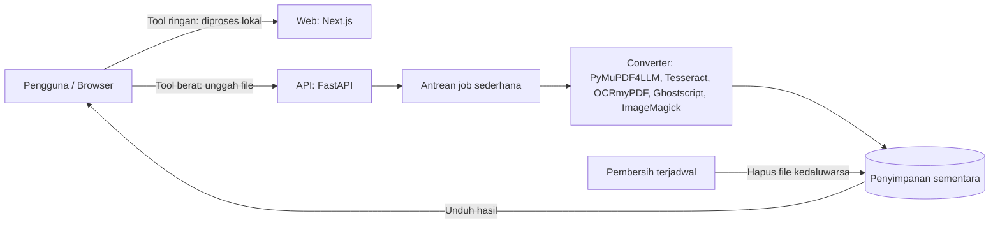

# Arsitektur

## Prinsip
1. **Browser dulu**: kalau tool bisa berjalan di browser (pdf-lib, pdf.js, canvas/WASM), jalankan di sana.
2. **Server seperlunya**: hanya untuk hal yang berat (OCR, PDF ke Markdown, Office ke PDF).
3. **Sementara, bukan permanen**: file di server selalu punya TTL dan dihapus otomatis.
4. **Terisolasi**: proses konversi memakai batas waktu, memori, dan berjalan sebagai user non-root di container.

## Komponen
| Komponen | Teknologi | Catatan |
|---|---|---|
| Web | Next.js + Tailwind | Satu halaman per tool (baik untuk SEO) |
| API | FastAPI (Python 3.11+) | Swagger otomatis di `/docs` |
| Job | asyncio / RQ | Redis baru ditambah jika perlu |
| Kontainer | Docker + Compose | Semua dependensi sistem di image API |
| CI | GitHub Actions | lint, test, build image |

## Alur tool server (contoh: PDF ke Markdown)
1. Web mengunggah file ke `POST /api/v1/convert/pdf-to-md`
2. API memvalidasi tipe, ukuran, jumlah halaman
3. Job dijalankan dengan timeout; hasil disimpan sementara
4. Web mengunduh hasil; file dihapus setelah TTL
